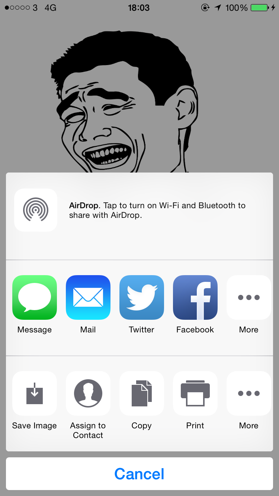
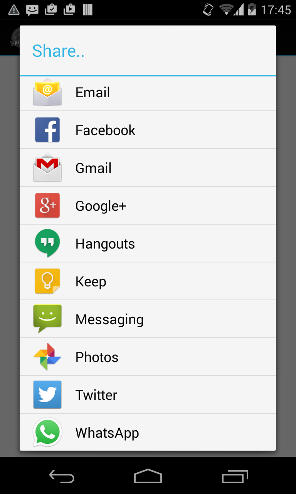

#Ti.NativeUnifiedSharing

##Native Unified (Social) Sharing CommonJS Module

This project provides a quick solution for implementing native sharing features on iOS and Android. It relies on the platform's way of sharing text/images. No need for any API keys!! 

On Android, it uses Intents.

On iOS, it uses the TiSocial.Framework module (which makes use of the native Share Sheets feature). 64 bit ready.

##Dependency
Download and install the following iOS module in your project (the sample project uses version 1.7.10 and TiSDK 3.5.1): https://github.com/viezel/TiSocial.Framework

Make sure you add it to your tiapp.xml file as well!

##Quick Start

Working sample project is provided. The main files are:

`app/lib/nativeSharing.js`

`app/lib/NativeSharing/iOSSharing.js`

`app/lib/NativeSharing/AndroidSharing.js`

This is how to use it in your code:

	var Share = require("nativeSharing");
    Share.share({
        text:"Super easy to share stuff the native way! :D",
        image:blob, // remove this line if you don't want to share an image
        win:$.win // required on Android, ignored on iOS
    });
    

##Screenshots

###iOS:

###Android:
 